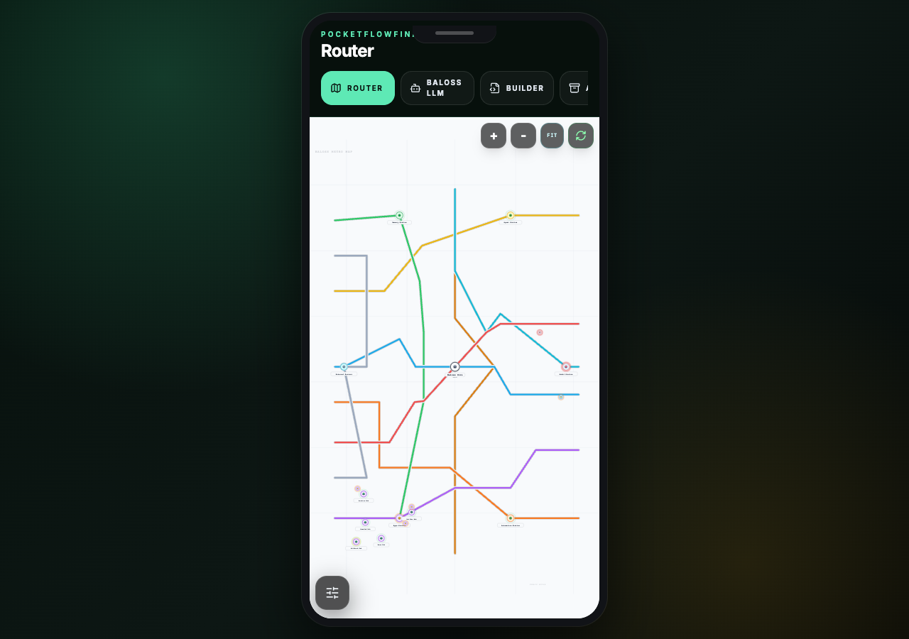
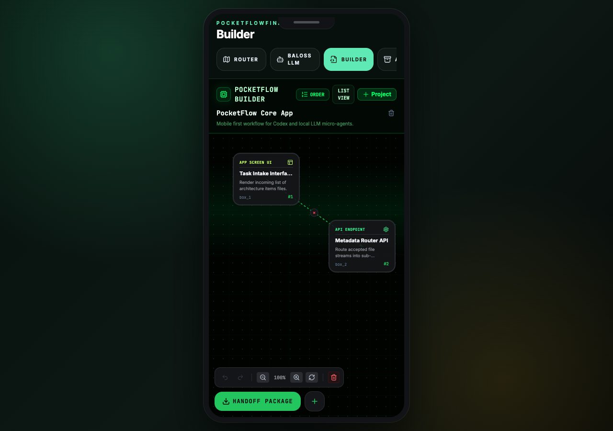
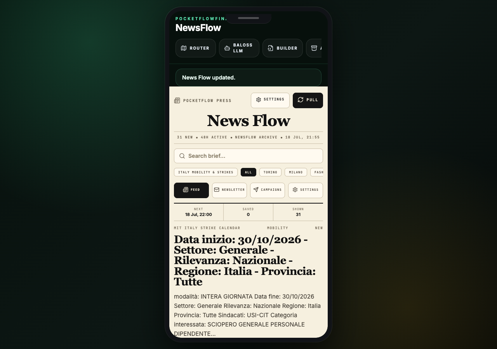
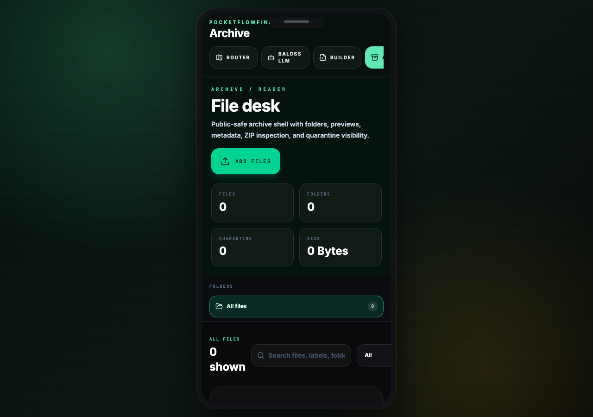

# PocketFlowFinal

PocketFlowFinal is a competition-safe public release of PocketFlow: a phone-first local AI operating shell for vibe-coding teams, builders, hackers, and curious people who want one small Android device to become a portable control room.

Built by Tanuki Labs, PocketFlow explores a simple question:

> How much team time, context switching, and API waste can we remove if every builder carries a tiny local AI operations console in their pocket?

The current prototype already runs on a second-hand Realme Android phone. That matters: this is not imagined only for flagship hardware or expensive cloud stacks. PocketFlow is designed for mid-range and low-range Android devices, where a local model, a WebView shell, and carefully scoped automations can turn spare hardware into a playful but serious productivity surface.

Tanuki Labs website: [www.tanukilabs.fun](https://www.tanukilabs.fun)

## Product Preview

### Baloss Panel / System Map



### Builder



### NewsFlow



### Archive / Reader



## What It Is

PocketFlowFinal is a public, sanitized snapshot of a larger private phone system. It keeps the reusable architecture and public-safe apps while removing private contacts, accounts, server endpoints, local databases, tokens, and personal data.

The idea is deliberately modular:

- A team installs PocketFlow on spare Android phones.
- Each person keeps the same shared operating spine.
- Every teammate can add their own workflows, automations, hobbies, tools, research dashboards, or toys.
- The local LLM coordinates small actions locally and wakes stronger reasoning only when needed.
- Apps become light, inspectable control surfaces rather than heavy cloud dashboards.

It is part productivity tool, part local AI lab, part customizable phone OS shell.

## Why We Built It

At Tanuki Labs, we care about maximizing creative time as a team. Vibe coding is fast, but the surrounding work is not always fast: planning, notes, CRM work, newsletters, file organization, handoffs, monitoring, context recovery, and phone-to-computer coordination all create friction.

PocketFlow turns that friction into a single playful system:

- One pocket dashboard for team automations.
- One local model spine for routine reasoning and app control.
- One archive for files, notes, plans, and generated outputs.
- One Builder flow for turning messy ideas into structured implementation plans.
- One app shell where new experiments can be added without rebuilding everything.

The fun part is intentional. A phone that feels like a tiny mission-control game is easier to use, easier to explain, and easier to personalize.

## Core Apps

### Builder

Builder is the main app and the heart of the system.

It is an offline-first manual configuration and prompt-architecture workspace. A user can break a project into boxes, chapters, agents, tasks, files, notes, and handoff packages. Instead of one giant prompt, Builder encourages clean structure:

- Box-by-box planning.
- File and note linking.
- Prompt preparation.
- Handoff packages for implementation.
- Reusable architecture blocks.

Builder is meant for teams that want cleaner plans before they ask an AI or teammate to implement.

### Baloss Panel And System Map

Baloss Panel is the local control layer for the phone. It connects model state, agent state, app state, and automation state into one visual control surface.

In the public release, the System Map uses the metro-style concept: apps, agents, queues, checks, relays, model routes, and automations are represented as connected stations and lines. The private system can experiment with more playful map skins, but the public version focuses on clarity and presentation.

### Baloss LLM

Baloss LLM is the local model interface. It is designed around routing:

- Small tasks should stay cheap and local.
- Navigation and simple actions should avoid unnecessary generation.
- Stronger reasoning should activate only when the task actually needs it.
- The phone should remain usable while AI features run in the background.

This helps reduce API dependency, improve privacy, and make the system more sustainable.

### NewsFlow

NewsFlow is a public-safe newsletter and research automation studio. The private build can send live newsletters; this public build keeps the workflow and UI but disables live delivery and removes contact lists.

NewsFlow demonstrates:

- Research collection.
- Campaign planning.
- Newsletter composition.
- Scheduling UI.
- App-level automation monitoring.

It shows how one app can turn phone-based research into structured communication from the palm of your hand.

### Archive / Reader

Archive is the merged file workspace and reader. It is designed to feel closer to a simple desktop file desk than a complex mobile file picker.

Public-safe features include:

- Local file import.
- Folder-style browsing.
- File preview.
- Metadata visibility.
- ZIP inspection.
- Quarantine visibility for risky files.

In the full private system, Archive also acts as the shared memory shelf where agents store reports, summaries, and user-facing outputs.

### MemoPad

MemoPad is the notes, tasks, and calendar capture surface. It is built around the idea that a note can stay a note, or become a task, shopping list, reminder, or calendar item when the user asks for structure.

The long-term goal is a phone-native capture tool that understands natural speech, mixed-language notes, and lightweight command intent without forcing the user into rigid forms.

### Notebook Agent

Notebook Agent is a public-safe template for agent-assisted posting workflows. The public repository contains the interface and local queue concepts, not private account keys or live publishing credentials.

### Screen Relay

Screen Relay demonstrates the bridge concept: phone and desktop can coordinate through a relay interface. In the private build, this has been used for Codex relay experiments, second-screen work, and hardware-control workflows. In the public build, private endpoints and chats are removed.

### Terminal

Terminal is a phone terminal surface for local command-style work. It is intentionally simple: copy, paste, multiple terminal pages, and a clean interface for future phone-side developer operations.

### Web And Router

The Web and Router surfaces provide lightweight browsing, app routing, and monitoring shells. They are examples of how PocketFlow apps can wrap normal phone functions into one consistent UI.

## What This Public Build Excludes

This repository is intentionally safe to publish.

It excludes:

- Private contacts and mailing lists.
- Personal chats and relay history.
- Private server URLs.
- Tokens, API keys, passwords, and account credentials.
- Local phone-owner databases.
- Private discovery and lead-finder data.
- Wallet/mining experiments.
- Game/emulator experiments.
- Live newsletter delivery secrets.
- Private generated reports.

The private personal backup belongs in a private repository only.

## Sustainability And Local-First Design

PocketFlow is designed to avoid using cloud AI for everything. The system favors local routing, local memory, and local automation whenever possible.

That means:

- Fewer API calls for routine work.
- Lower recurring cost.
- Less unnecessary data movement.
- Better offline resilience.
- More control for the person holding the device.

The prototype is intentionally built around hardware that would usually be considered disposable or underpowered. Reusing a second-hand Android phone as an AI control surface is part of the product philosophy.

## Team Use Case

PocketFlow is meant for teams where every member wants a personal operating layer without losing shared structure.

Example team flow:

- One person uses Builder to plan a feature.
- Another uses NewsFlow to track market signals.
- Another customizes MemoPad for meetings and tasks.
- A developer connects Relay and Terminal for phone-to-computer control.
- The team shares app modules while each person keeps their own local automations.

The public apps are examples. The architecture is the real product.

## Current Prototype Status

PocketFlowFinal is a working public shell, not a finished consumer app.

Working in the public snapshot:

- Public app router.
- Builder workspace.
- Metro-style System Map.
- Local LLM panel UI.
- Archive / Reader public shell.
- MemoPad / Calenotes UI.
- NewsFlow campaign UI with delivery disabled.
- Notebook Agent template.
- Screen Relay public shell.
- Terminal shell.
- Web workspace.
- Public privacy scrubber.

Private-only integrations have been removed by design.

## Run Locally

```bash
cd receive-hub
npm install
npm run dev:phone
```

Open:

```text
http://127.0.0.1:3000
```

The public preview is intentionally rendered inside an Android-phone frame on desktop browsers. On a real phone-sized viewport it expands to the full screen, matching the intended installation target.

Useful checks:

```bash
npm run lint
npm run build
node ../scripts/scan-public-release.mjs
```

## Public Privacy Check

The repository includes a release scanner:

```bash
node scripts/scan-public-release.mjs
```

The public app also clears old PocketFlow local browser storage on startup so a reused development browser does not accidentally display private preview data.

## Competition Pitch

PocketFlowFinal is a playful local AI phone shell for builders:

- It turns spare Android phones into team AI control panels.
- It keeps core work local when possible.
- It makes automations visible and editable.
- It lets every teammate customize their own operating layer.
- It demonstrates how vibe-coding workflows can move from scattered tabs into one coherent pocket system.

The product vision is not just another productivity app. It is a small, extensible, local-first operating surface for AI-native teams.
